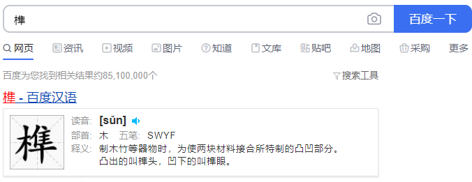
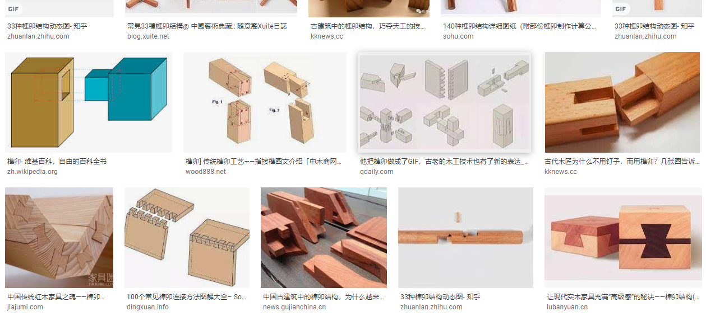
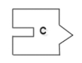
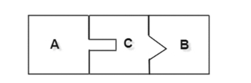
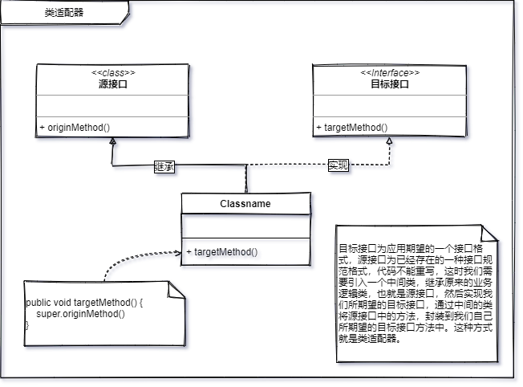

# 什么是"榫"

嘶衣唔嗯ěn损，fao喽密，榫！

首先，让我们面向百度学习一波。

榫[sǔn]：制木竹等器物时，为使两块材料接合所特制的凸凹部分。

感觉不够直观，找点图看看。

再来点

这里我借花献佛一下，榫说的是两块材料接合凸起的部分，凹进去的部分叫卯。

这东西是干什么用的呢，我不说大家也知道，是两块材料接合所用（切，这不废话吗，就是百度百科上说的么）。在中国建筑当中这个榫卯的用途可以说是处处皆是。现在已经火到了国外。

# 榫卯

本来两种材料，一榫、一卯搭配的天衣无缝，怪就怪这建筑用的多了起来之后，各种各样的榫，各种各样的卯。也没办法统一，垄断法了解一下。

>以下图片资源来自《设计模式之禅（第2版）》对其进行了一些简单的调整。

**原来都是这样进行搭配**

**突然有一天给了我一个**

这两个材料怎么接，榫不对卯，卯不对榫，接不上啊。

这可难不倒伟大的工匠艺人们，他们做出来了一个 榫卯，大概是这个样子。

这样他们就能完美的接在一起使用了。这就是榫卯。

榫卯使得本来不能直接接合的材料能够接合起来了。看到这里让我想到了插在大哥电脑上的扩展坞

这是华为的扩展坞，整个电脑上就两个外接口，一个充电口，一个这个扩展坞的口。想接 USB 设备必须要经过这个扩展坞才可以。

# 适配器模式

> 将一个类的接口转换成客户希望的另外一个接口，使得原本由于接口不兼容而不能一起工作的那些类能一起工作。

首先大家要知道一个可能一直被大家忽略的一个问题就是，适配器模式一共有两种，一种是类适配器，另一种叫做对象适配器。这两个是什么东西呢，经过鄙人的一词一句话概括如下：

**类适配器：通过类的继承或者接口的实现来达到适配目的；**

**对象适配器：通过对象的组合来达到适配目的；**

## 适配器模式类图 📌

再来看看图，消化吸收一下。

## 代码 📃

## 总结 📚

----

    <b>亦或繁星、亦或尘埃。星尘✨，为了梦想，学习技术，不要抱怨、坚持下去💪。</b>
    
关注<b style='color:blue'>星尘的一个朋友</b>获取源码、加群一起交流学习🤓。

    

