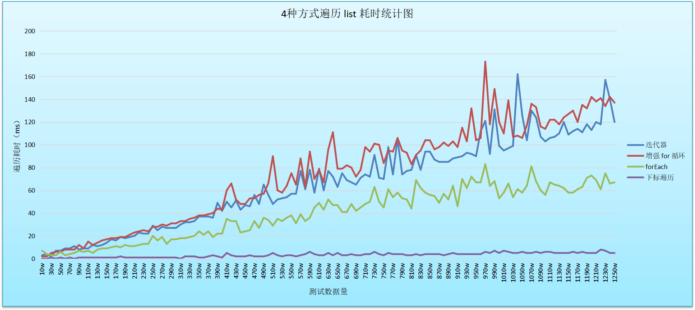
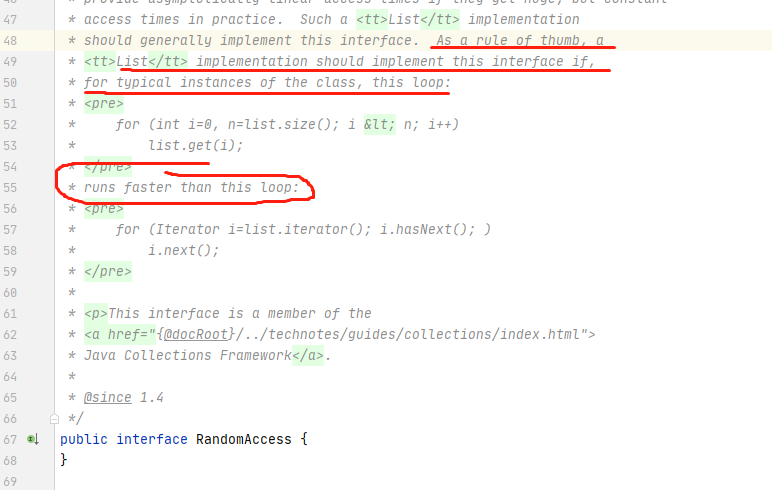
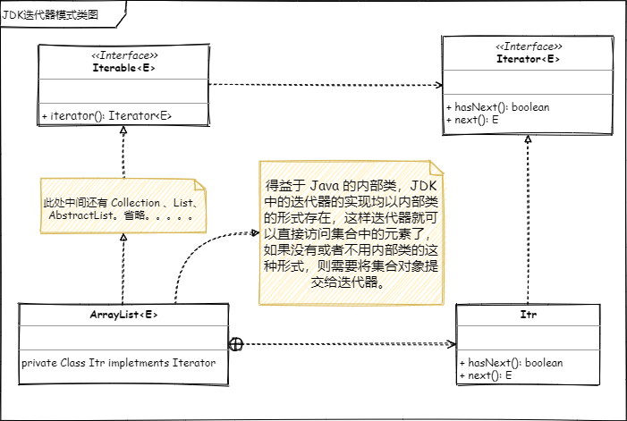

# 迭代器模式

> 提供一种方法来顺序访问聚合对象中的一系列数据，而不暴露聚合对象的内部表示。

在看迭代器模式之前，我觉得应该来研究一段代码开开胃先。

## Java 中的 List 集合遍历

```java
public class Appetizer {

    public static void main(String[] args) {
        ArrayList<String> strings = new ArrayList<>();
        for (int i = 1; i <= 10; i++) {
            strings.add("第" + i + "个元素");
        }
        Iterator<String> iterator = strings.iterator();
        while(iterator.hasNext()) {
         	iterator.next();
        }
    }
}
```

这段代码很简单，我们在日常开发中可能也是经常使用到。有的人可能会说了，啊不对，我用的都是

```java
for(int i = 0; i < strings.size(); i++)
```

还有的朋友说了，我直接用增强``for``循环啊

```java
for(String s : Strings)
```

是的，没错。在日常开发中，或多或少的人会用以上两种方式来进行一个列表的遍历。那这两者有什么区别呢？让我们通过编译出来的 ``class``  文件来一探究竟吧。

这里使用三种不同的写法来遍历一个 list

**java 源码文件**

```java
// 1. 使用迭代器遍历
Iterator<String> iterator = strings.iterator();
while(iterator.hasNext())
	iterator.next()

// 2. jdk 8 提供的 lambda 写法
strings.forEach(System.out::println);

// 3. 增强 for 循环写法
for (String string : strings) {
    System.out.println(string);
}

// 4. 下标遍历
for (int i = 0; i < strings.size(); i++) {
    System.out.println(strings.get(i));
}
```

**class 反编译的 java 文件内容**

```java
// 1. 使用迭代器遍历
Iterator<String> iterator = strings.iterator();
while(iterator.hasNext()) {
    iterator.next();
}

// 2. jdk 8 提供的 lambda 写法
var10001 = System.out;
strings.forEach(var10001::println);
Iterator var3 = strings.iterator();

// 3. 增强 for 循环写法
while(var3.hasNext()) {
    String string = (String)var3.next();
    System.out.println(string);
}

// 4. 下标遍历
for(int i = 0; i < strings.size(); ++i) {
    System.out.println((String)strings.get(i));
}
```

第一种和第三种可以算为同一种，所以就只剩下三种迭代方式

```java
// 1. 增强 for 循环（迭代器）
for(String s : Strings)
// 2. JDK8 的 forEach 方法
Strings.forEach()
// 3. 下标遍历
for(int i = 0; i < strings.size(); i++)
```

接下来我们用数据来看一下这几种方式的表现情况

**第一次**

```java
测试方法：iterator
测试数据量：1000000
花费时长（ms）：21
-----------------------------
测试方法：forEach
测试数据量：1000000
花费时长（ms）：132
-----------------------------
测试方法：增强 for 循环
测试数据量：1000000
花费时长（ms）：18
-----------------------------
测试方法：下标遍历
测试数据量：1000000
花费时长（ms）：1
-----------------------------
```

**第二次**

```java
测试方法：iterator
测试数据量：1000000
花费时长（ms）：17
-----------------------------
测试方法：forEach
测试数据量：1000000
花费时长（ms）：123
-----------------------------
测试方法：增强 for 循环
测试数据量：1000000
花费时长（ms）：12
-----------------------------
测试方法：下标遍历
测试数据量：1000000
花费时长（ms）：3
-----------------------------
```

**第三次**

```java
测试方法：iterator
测试数据量：1000000
花费时长（ms）：18
-----------------------------
测试方法：forEach
测试数据量：1000000
花费时长（ms）：119
-----------------------------
测试方法：增强 for 循环
测试数据量：1000000
花费时长（ms）：14
-----------------------------
测试方法：下标遍历
测试数据量：1000000
花费时长（ms）：2
-----------------------------
```

为了更直观的展示，我整理了一张统计图



通过数据也证实了 迭代器 和 增强 for 循环的写法效果相同。

## List 集合到底该如何遍历

其实乍一看数据，应该用下标遍历这种方式啊，当然，正常是这样的，这是因数组的下标索引决定的它的访问时间复杂度O(1)，同时 JDK 也为 ``ArrayList`` 增加了

```java
public interface RandomAccess {
}
```

标记。标记其为随机访问集合。



Java 官方给出的遍历说明：根据经验，下标要比迭代器更快。

当然，根据我们对数据的测试表现情况来看，当你的数据量低于30w时，这个时间差基本是没有任何影响的，我想，这一切应该得益于当下处理器的计算能力以及内存更高的数据交互速度吧。所以你用以上的 4 种方式都是没有问题的。但是如果你遍历的数据量大于100w时，一定要使用下标遍历了。

关于 List 集合的遍历，我们就讨论这么多，更主要的是我们要讨论一下上面提到的一个东西，“迭代器”

> 文末关注回复“源码”获取本文测试使用代码及图表数据

## 迭代器

我通过上面的开胃菜知道，迭代器是用来遍历集合的，或者说它是用来遍历的。

这个时候我们就想了，那刚刚的列表不用这个迭代器速度反而更快，用它还慢还麻烦，为什么要用它呢？

我们可以想象一下，如果此时的数据结构不是数组，而是链表、是树、是图呢？

集合本身的目的是存取，目的明确，但如果我们在集合本身增加了遍历操作的话，我们可以看看下图。


> 图片来源：https://refactoringguru.cn/design-patterns/iterator

假如对于一个链表，我们开始想要以 DFS 方式遍历，写好了一个算法在集合类中，后面发现有需要 BFS 方式遍历这个集合，以目前这种方式，就只能去修改集合类，再加一个方法。如果哪天发现这两个都不合适，又要加一个呢，慢慢的，集合本身的存取目的开始变得不明确，这其实是因为违反了``单一职责``原则。

致使遍历访问的问题需要被单独解决。于是迭代器就出现了，它要解决的问题就是用来遍历集合，同时它并不需要去关注具体要遍历的集合是什么样的数据结构。这里我们可以回想一下刚刚测试遍历列表的操作，迭代器在迭代的时候，它知道遍历的具体的数据结构是什么吗？不知道，对于一个迭代器来讲，它只需要关注如何将集合的数据完整无缺的取出来就好了。

这样，迭代器的概念就捋清了，再看看迭代器模式的定义

> 提供一种方法来顺序访问聚合对象中的一系列数据，而不暴露聚合对象的内部表示。

接下来我们就看看 JDK 中是怎么样用这个迭代器模式来设计集合遍历程序的。go！

## 迭代器模式类图 📌



下面是根据 JDK 的类直接生成的 UML 类图

> 注意：并非全部类生成的 UML 类图，这里去掉了一些无关类。


## 代码 📃

因为迭代器模式是围绕 JDK 的 iterator 来学习的，所以这里具体的迭代器模式的实现代码就没有自己实现，不过这里学习了 JDK 的代码。我就简单记录一下 JDK 的实现思路。

1. 定义一个可被迭代的约束类，表示其子类可以被迭代器迭代，这里用的是 ``Iterable``接口。
2. 定义迭代器接口，其子类为具体的迭代器实现。这里说的是``Iterator`` 接口。
3. 可被遍历的集合实现``Iterable`` 接口，比如 ``ArrayList``。
4. 具体迭代器的实现``Iterator``接口，JDK 使用的 ArrayList 的内部类 Itr 来实现的这个接口。
5. 迭代器中的提供一个顺序访问的规则，然后通过顺位标识调用集合的“get”方法。

为了直观表示这个"get"方法，我贴几个迭代器的 next() 实现关键部分代码。

**ArrayList**

```java
public E next() {
     // 这里的 elementData[i] 就是我上面说的 “get” 方法
    return (E) elementData[lastRet = i];
}
```

**LinkedList**(使用的是 AbstractList 的迭代器)

```java
public E next() {
    // 这里的 get 就是我上面说的 “get” 方法
    E next = get(i);
    return next;
}
```

**HashSet/HashMap**

```java
public final K next() {
    // 这里的 nextNode() 就是我上面说的 “get” 方法
    return nextNode().key;
}
final Node<K,V> nextNode() {
    Node<K,V>[] t;
    Node<K,V> e = next;
    if ((next = (current = e).next) == null && (t = table) != null) {
        do {} while (index < t.length && (next = t[index++]) == null);
    }
    return e;
}
```


以上内容可以配合 JDK 源码了解，下面列一些涉及类或方法位置

1. ``Iterable.java``
2. ``Iterator.java``
3. ``ArrayList.java``
4. ``java/util/ArrayList.java:846`` （jdk8）


## 总结 📚

1. 迭代器模式主要解决的问题就是集合的遍历与集合访问要进行合理的划分职责，这满足了**单一职责**原则。集合类本身专注集合的存取，迭代器专注集合的遍历。
2. 同时迭代器在实现的过程中不需要关注待遍历集合的数据结构，因为它会使用目标集合的“get"方法来按序读取集合元素。所以这使得了同一个迭代器可以遍历不同的集合，同样的同一个集合也可以用不同的迭代器来进行遍历。
3. 因为有了迭代器接口和可被迭代的集合接口两个接口的设计方式可以在集合或迭代器的扩展上提供很好的支持，这也满足了**开闭原则。**
4. **这个模式基本不会使用。除非你有自己的数据结构和对他们的遍历规则时。**


----
<div align="center">
    <b>亦或繁星、亦或尘埃。星尘✨，为了梦想，学习技术，不要抱怨、坚持下去💪。</b>
    <p>关注<b style='color:blue'>星尘的一个朋友</b>获取源码、加群一起交流学习🤓。</p>
    
</div>
