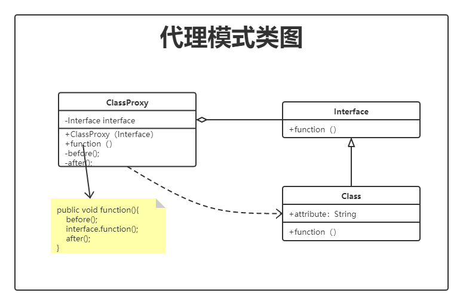

# 代理模式 👥

> 为某对象提供一种代理以控制对该对象的访问。即客户端通过代理间接地访问该对象，从而限制、增强或修改该对象的一些特性。

代理模式可以让我们真正的业务对象更专注自己要做的事情

比如经纪人，他代理了明星（主体），负责主体功能以外的事情，主体可以进行商演，但在商演以前或以后的事情，都不需要主体去关系，全部都由经纪人去处理。

一个公园的门禁，通过门禁系统，代理了公园的入口，公园入口只负责放人进入公园，不关心什么时候什么情况，来人就表示可以进入。门禁系统则负责什么时候，什么情况可以进。

通过使用代理模式，可以让我们的业务代码结构更加完整清晰，而将一些控制和辅助型的逻辑处理交给代理类，这其中体现的就是单一职责原则与迪米特法则。

## 代理模式类图 📌

## 代码 📄

## 总结 🐱‍💻

# 写在最后

　　Java 设计模式专题，共23 种设计模式。内容来自个人学习理解消化的结果，谈不上教程，只望记录于此同你分享。希望能够和大家一起进步、成长。为了梦想，学习技术。如果你觉得文章对你有帮助，希望随便点赞、关注、分享、给个 star 支持一下。感激涕零🎈。

　　[⭐https://github.com/lvgocc/java-design-patterns](https://github.com/lvgocc/java-design-patterns)

　　**星尘的一个朋友** 亦或繁星、亦或尘埃。星尘，为了梦想，学习技术。
  
　　关注公众号，回复“加群”，和 lvgo 一起学习设计模式。坚决维护群内环境，给大家提供一个良好的学习交流环境。

