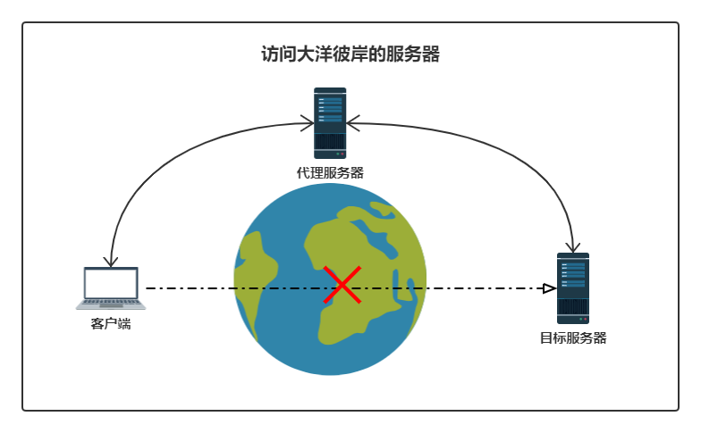

# 设计模式的学习问题⁉❔

我一直都在想如何学会一个新东西，和掌握一个旧东西🤔，有很多前辈给过一些建议和意见📑，（当然不是直接给我，都是看大佬的文章或者书籍当中。）先去用，再去学。嗯，我想是的，这样肯定是个很正常的学习过程。但是对于一些你暂时无法使用的东西，你如何去掌握它呢？我认为应该抛开表象去了解本质，通过本质的类比去掌握那些暂时无法使用的东西。设计模式就是这种情况，在平常的开发中，常用的设计模式就那么几种，其它的那些没有机会去接触，干学，如何才能掌握呢？🗃

我从小就是一个好为人师的家伙🤓，然而自己学习却一直都不怎么样😢。人太实在，也不懂的包装，我只知道我学习这么差的能学会的东西，讲给别人应该差不哪去。😊

在学习算法的时候，学到一个特别巧妙而且很好用的解题思路或者说逻辑思维``”分而治之“``，还有之前和网友讨论的一个叫做``”复杂度守恒定律“``的东西。这两个东西放在一起，可以说是很”矛盾“⚔🛡了。

说了这么多我想说的就是，设计模式这个知识点，真的很简单又很难。简单是因为每种设计模式的定义拿出来都能看的懂，难是难在如何，何时的应用。而我希望我写的这个设计模式系列是去应用化的，就是单纯的把设计模式的思想记录下来。我所理解的设计模式就该如此。

GOF的**《设计模式.可复用面向对象软件的基础》**通过一个应用案例的实现，串起了23种设计模式，我想在系列更新完之后也更新一个应用，将 23 种设计模式尽可能的应用到一个应用案例中去，而不是每个设计模式都涉及具体的应用，因为我觉得这可能会带的人们更关注应用的实现，而不是设计模式的应用，这是我的一些想法。

**不要纠结每种模式的具体实现，把它们抽象出来，你能够清楚的描述每种模式是为了解决什么问题而存在的时候，就已经掌握它了，就可以把它用在任何当你需要的时候。而不是问什么时候需要它，这可能有点绕，不过它是真的。不要问我设计模式可以解决哪些问题，把问题给我，我告诉你用什么设计模式可以解决它！**

*我发现我更适合写一些畅谈型的文章🤣*

# 代理模式 👥

> 为某对象提供一种代理以控制对该**对象的访问**。即客户端通过代理间接地访问该对象，从而限制、增强或修改该对象的一些特性。

代理模式是为了解决**对象的访问控制**，特别是当你的目标对象不可改变的时候。效果更佳明显。

先来几段对话，简单感受一下这个“代理”

- “这 google 好慢啊，搞个代理”
- “您好，请问明年3月-12月有档期吗？” ”和我经纪人联系“
- “我要告你” “好啊，有什么问题跟我的律师说吧”
- “哦？是海大富海公公” “这是皇上口谕” “啊？（急忙下跪）“
- “您好，这里是 12345 市长热线”

**“控制一个实际的对象访问，同时可以达到一定的目的”**

## 生活中的比喻

希望可以用生活中的一些例子能让我更好的去表达和梳理代理模式

### 明星&经纪人

比如经纪人，他代理了明星（主体），负责主体功能以外的事情，主体可以进行商演，但在商演以前或以后的事情，都不需要主体去关系，全部都由经纪人去处理。

### 公园门&门禁

一个公园的门禁，通过门禁系统，代理了公园的入口，公园入口只负责放人进入公园，不关心什么时候什么情况，来人就表示可以进入。门禁系统则负责什么时候，什么情况可以进。

通过使用代理模式，可以让我们的业务代码结构更加完整清晰，而将一些控制和辅助型的逻辑处理交给代理类，这其中体现的就是单一职责原则与迪米特法则。

上面的两个例子，我所想要表达的意思就是说明代理模式是为了**控制一个实际对象的访问**而存在的一种模式。不知道我说清了没有。

## 程序中的例子

### mybats 的数据访问接口

在代理模式中我们最常用到的应该就是 ORM 框架中的应用了，我们熟知的 mybatis 对**数据库的访问控制**就是使用了代理模式，通过一个接口的定义，来代理了数据库的访问操作。

在 mybatis 的代理模式处理思想如果翻译成白话：”你将你要执行的 SQL 告诉我在哪（mapper 映射，statement space），语句写好（xml）剩下的你都不用管“，这里的 mapper 接口即代理了数据库的访问工作。

**甚至 #{} ${} 占位符，也是一种代理模式的体现，不一定非要有完整的接口，具体的实现类，代理类才是代理模式。**可能这理解起来会让你觉得有点强词夺理。


## 代理模式类图 📌


## 代码 📄

> 完整代码获取关注公众号：星尘的一个朋友 回复 “源码”

为了在深入的理解一下代理模式，我选择使用 mybatis 的代理模式实现原理伪代码。以及挖掘一下JDK动态代理的一些细节内容，当然我不会去写源码的东西（毕竟道理大家都懂，不可能凭空 new 出来一个接口的实例，这当中定有蹊跷，我相信你在任何一篇博文中都能看到这部分内容，当然也欢迎加我微信（lvgocc）进群讨论）

**mybatis的核心代理模式伪代码**

```java
/**
 * 用户接口
 *
 * @author lvgorice@gmail.com
 * @date 2020/10/21 22:51
 * @since 1.0.0
 */
public interface UserMapper {

    /**
     * 查询
     *
     * @param id 用户id
     */
    void selectByUserId(int id);
}
```

```java
UserMapper o = (UserMapper) Proxy.newProxyInstance(
        UserMapper.class.getClassLoader(),
        new Class[]{UserMapper.class},
        (proxy, method, arg) -> {
            // 这里会执行具体的连接数据库执行 SQL 的操作 感兴趣可以查看 mybatis 源码继续了解。
            
            // 打印参数
             logger.info("statement position: {}, args: {}", method.getDeclaringClass().getCanonicalName() + "#" + method.getName(), Arrays.toString(arg));
             return "用户id：" + arg[0] + "公众号：星尘的一个朋友，加群一起学习设计模式";
        });
```

```reStructuredText
14:25:43.966 [main] INFO io.github.lvgocc.App - Hello World!
14:25:44.251 [main] INFO io.github.lvgocc.App - statement position: io.github.lvgocc.proxy.dynamic.UserMapper#selectByUserId, args: [2333]
14:25:44.258 [main] INFO io.github.lvgocc.App - 查询结果：用户id：2333公众号：星尘的一个朋友，加群一起学习设计模式
```

mybatis 使用动态代理，让一个接口去代理了真实的数据库对象，当你需要的时候，再去建立连接、访问数据库、执行SQL、返回结果。如果之前有了解过 mybatis 的代理模式，这里应该不难理解。

**下面再看一个简单的例子，当然用图说明可能会更容易**



> 请忽略图中示意具体内容，只是借图表达代理的意义，控制对象的访问。


## 总结一下 🐱‍💻

代理模式为了解决对象的访问控制而存在。

- 当你想要抢一张``回家的车票``，你选择了``候补``，他选择了``加速``.此时 12306 或是 第三方 成了你的购票代理人。
- 当你来到一个``陌生的小区``，需要刷``门禁``卡才能进入。此时`` 门禁 ``成了``小区``的代理。

通过上面的总结，我知道

1. 当我选择了候补，我和购票**解耦了**✔，不需要等它的结果，等通知就行。但中间多了一个候补，**链路更长**❌了。
2. 我进门要刷卡，**维护的对象多了**❌，虽然**系统变得复杂**❌了，但小区**更安全**✔了，保护了小区。

----
<div align="center">
    <b>亦或繁星、亦或尘埃。星尘✨，为了梦想，学习技术，不要抱怨、坚持下去💪。</b>
    <p>关注<b style='color:blue'>星尘的一个朋友</b>获取源码、加群一起交流学习🤓。</p>
    
</div>
