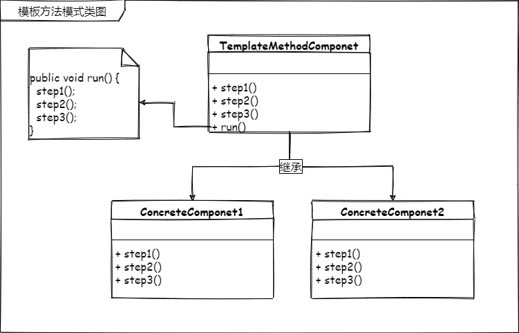

# 冲

终于来到了设计模式的“人性”部分行为型模式，为什么说行为型模式呢，因为行为型模式当中的 11 种设计模式都非常的友好啊，都可以用非常简单粗暴的生活中的例子来解释理解。所以接下来的内容可能让我学起来更有趣些有说不定。

# 模板方法模式

> 定义一个操作中的算法骨架，将算法的一些步骤延迟到子类中，使得子类在可以不改变该算法结构的情况下重定义该算法的某些特定步骤。

## 如何理解

定义一个操作中的算法骨架，说白了这不就是一个步骤约束吗？在看第二段，将算法的一些步骤延迟到子类中，意思就是步骤里的一部分留给你了，具体怎么做看你（子类）自己了。使得子类在可以不改变该算法结构的情况下重定义该算法的某些特定步骤，这句就更好理解了，有了步骤的约束，你负责执行具体的步骤，说白了，步骤只要执行就可以，不管你怎么做，所以也就有了不改变结构的情况下可以重新定义特定的步骤，这里的特定指的就是约束步骤里留给你的那部分步骤。

## 重新定义

模板方法模式就是：提供一个具体的步骤，1,2,3,4，现在1,2,4都写好了，步骤3的实现由具体的执行者说了算，只要步骤符合要求，随你发挥。

## 模板方法模式类图 📌

## 代码 📃

## 总结 📚

----

    <b>亦或繁星、亦或尘埃。星尘✨，为了梦想，学习技术，不要抱怨、坚持下去💪。</b>
    
关注<b style='color:blue'>星尘的一个朋友</b>获取源码、加群一起交流学习🤓。

    

